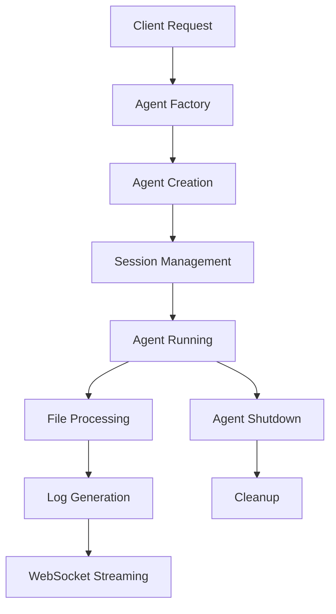

# Architecture Review

## Overview

This document provides a comprehensive review of the Parallel Agents project architecture, covering the complete transformation from a CLI-only tool to a modern server-client architecture with plugin extensibility.

## System Architecture

### High-Level Architecture

The Parallel Agents system follows a **server-client architecture** with the following key components:

```
┌─────────────────────────────────────────────────────────────────┐
│                      Client Layer                               │
├─────────────────────────────────────────────────────────────────┤
│  ParallelAgentsClient  │  AgentProxy  │  WebSocket Connections  │
└─────────────────────────────────────────────────────────────────┘
                                    │
                                    │ HTTP/WebSocket
                                    │
┌─────────────────────────────────────────────────────────────────┐
│                      Server Layer                               │
├─────────────────────────────────────────────────────────────────┤
│  FastAPI Server  │  WebSocket Manager  │  Agent Sessions       │
└─────────────────────────────────────────────────────────────────┘
                                    │
                                    │
┌─────────────────────────────────────────────────────────────────┐
│                      Core Layer                                 │
├─────────────────────────────────────────────────────────────────┤
│  Agent Factory  │  Configuration  │  Monitoring  │  Review      │
└─────────────────────────────────────────────────────────────────┘
                                    │
                                    │
┌─────────────────────────────────────────────────────────────────┐
│                   External Tools                                │
├─────────────────────────────────────────────────────────────────┤
│  Block Goose    │  Claude Code    │  Mock Agents               │
└─────────────────────────────────────────────────────────────────┘
```

## Directory Structure

The project is organized into a modular structure:

```
src/
├── server/                     # FastAPI Server
│   ├── app.py                 # Main application with WebSocket support
│   ├── routes/                # API route handlers
│   │   ├── agents.py          # Agent management endpoints
│   │   ├── config.py          # Configuration management
│   │   ├── health.py          # Health check endpoints
│   │   └── working_set.py     # Working set file management
│   └── models/                # Pydantic models (future expansion)
│
├── client/                    # Client SDK
│   ├── client.py             # Main client class
│   ├── agent.py              # Agent proxy objects
│   ├── exceptions.py         # Client-specific exceptions
│   └── __init__.py           # Client package exports
│
├── core/                     # Business logic
│   ├── config/               # Configuration management
│   │   ├── models.py         # Configuration data models
│   │   ├── profiles.py       # Pre-built configuration profiles
│   │   └── __init__.py       # Configuration exports
│   │
│   ├── agents/               # Agent implementations
│   │   ├── base.py           # Abstract base agent class
│   │   ├── factory.py        # Agent factory functions
│   │   ├── goose/            # Block Goose agent implementation
│   │   │   ├── agent.py      # Goose agent classes
│   │   │   └── runner.py     # Goose headless execution
│   │   ├── claude/           # Claude Code agent implementation
│   │   │   └── agent.py      # Claude Code agent classes
│   │   └── mock/             # Mock agent for testing
│   │       └── agent.py      # Mock agent implementation
│   │
│   ├── monitoring/           # File monitoring and change detection
│   │   ├── delta_gate.py     # File change detection
│   │   ├── watcher.py        # File system watcher
│   │   └── working_set.py    # Working set management
│   │
│   ├── overseer/             # Agent orchestration
│   │   ├── overseer.py       # Main overseer class
│   │   └── mock_overseer.py  # Mock overseer for testing
│   │
│   └── review/               # Code review functionality
│       ├── agent.py          # Review agent implementation
│       └── reporter.py       # Review reporting
│
└── utils/                    # Shared utilities
    ├── calculator.py         # Mathematical utilities
    └── __init__.py           # Utility exports
```

## Key Components

### 1. Server Layer (`src/server/`)

#### FastAPI Application (`app.py`)
- **Purpose**: Main server application with WebSocket support
- **Key Features**:
  - RESTful API endpoints for agent management
  - WebSocket connections for real-time log streaming
  - CORS support for cross-origin requests
  - Session management for active agents
  - Health monitoring and status reporting

#### Route Handlers (`routes/`)
- **`agents.py`**: Agent lifecycle management (start, stop, process files)
- **`config.py`**: Configuration and profile management
- **`health.py`**: System health checks and monitoring
- **`working_set.py`**: Working set file management

### 2. Client Layer (`src/client/`)

#### ParallelAgentsClient (`client.py`)
- **Purpose**: Main client interface for interacting with the server
- **Key Features**:
  - HTTP client for RESTful API calls
  - WebSocket client for real-time log streaming
  - Agent proxy management
  - Connection pooling and error handling
  - Context manager support for cleanup

#### AgentProxy (`agent.py`)
- **Purpose**: Client-side representation of server-side agents
- **Key Features**:
  - Proxy pattern for remote agent operations
  - Log subscription management
  - File processing delegation
  - Status monitoring

### 3. Core Layer (`src/core/`)

#### Configuration System (`config/`)
- **Models**: Pydantic-based configuration validation
- **Profiles**: Pre-built configuration profiles for different use cases
- **Features**:
  - Type-safe configuration handling
  - Profile-based configuration management
  - Validation and error handling
  - JSON serialization/deserialization

#### Agent System (`agents/`)
- **Base Agent**: Abstract base class defining agent interface
- **Factory Pattern**: Centralized agent creation and management
- **Implementations**:
  - **Block Goose**: Headless execution with `goose run`
  - **Claude Code**: Integration with Claude Code CLI
  - **Mock**: Testing and development agent

#### Monitoring System (`monitoring/`)
- **Delta Gate**: File change detection and filtering
- **Watcher**: File system monitoring
- **Working Set**: Temporary file management for agent processing

## Agent Architecture

### Agent Lifecycle



### Agent Types

1. **Verifier Agents**: Focus on code verification and testing
2. **Documentation Agents**: Generate and maintain documentation
3. **Review Agents**: Perform code reviews and analysis

### Agent Implementations

#### Block Goose Agent
- **Installation Check**: Verifies `goose --version` availability
- **Headless Execution**: Uses `goose run` command for non-interactive processing
- **Session Management**: Maintains isolated sessions for each agent
- **Timeout Handling**: Configurable timeout for long-running operations

#### Claude Code Agent
- **Platform Support**: Currently supports non-Windows platforms
- **Integration**: Direct integration with Claude Code CLI
- **File Processing**: Batch processing of file changes

#### Mock Agent
- **Testing**: Provides consistent behavior for testing
- **Development**: Allows development without external dependencies
- **Simulation**: Simulates real agent behavior with predictable responses

## Configuration System

### Configuration Profiles

The system includes pre-built configuration profiles:

1. **Testing Profile**:
   - Code tool: Block Goose
   - Log level: DEBUG
   - Max iterations: 3
   - Purpose: Development and testing

2. **Documentation Profile**:
   - Code tool: Block Goose
   - Mission: Documentation generation
   - Purpose: Automated documentation

3. **Demo Profile**:
   - Code tool: Mock
   - Purpose: Demonstrations and examples

4. **Minimal Profile**:
   - Basic configuration
   - Purpose: Minimal resource usage

5. **Full Stack Profile**:
   - Complete feature set
   - Purpose: Production deployments

### Configuration Management

- **Validation**: Pydantic-based validation with type checking
- **Inheritance**: Profile-based configuration inheritance
- **Flexibility**: Runtime configuration override capability
- **Persistence**: Configuration saving and loading

## Communication Architecture

### HTTP API

The server exposes RESTful endpoints:

- **`/api/agents/`**: Agent management operations
- **`/api/config/`**: Configuration and profile management
- **`/api/health/`**: Health checks and system status
- **`/api/working-set/`**: Working set file operations

### WebSocket Streaming

Real-time log streaming via WebSocket:

- **Connection Management**: Per-agent WebSocket connections
- **Log Filtering**: Configurable log level filtering
- **Subscription Model**: Client-side log subscription management
- **Automatic Reconnection**: Robust connection handling

## Security Considerations

### Current Implementation

- **Input Validation**: Pydantic-based request validation
- **Error Handling**: Structured error responses
- **Resource Management**: Proper cleanup and resource limiting

### Future Enhancements

- **Authentication**: JWT-based authentication system
- **Authorization**: Role-based access control
- **Rate Limiting**: Request rate limiting
- **Audit Logging**: Comprehensive audit trail

## Performance Characteristics

### Strengths

1. **Asynchronous Processing**: FastAPI's async capabilities
2. **Connection Pooling**: Efficient connection management
3. **Modular Design**: Minimal resource overhead per component
4. **Caching**: Configuration and profile caching

### Optimization Opportunities

1. **Database Integration**: Persistent state management
2. **Horizontal Scaling**: Multi-instance deployment
3. **Resource Monitoring**: Advanced resource usage tracking
4. **Load Balancing**: Distributed agent execution

## Integration Points

### External Tool Integration

1. **Block Goose**: 
   - Installation verification
   - Headless execution via `goose run`
   - Session management
   - Timeout handling

2. **Claude Code**:
   - CLI integration
   - Platform-specific support
   - File processing capabilities

3. **Mock Systems**:
   - Testing framework integration
   - Development environment support

### Plugin Architecture

The system is designed for extensibility:

- **Agent Plugins**: New agent types can be easily added
- **Configuration Plugins**: Custom configuration providers
- **Monitoring Plugins**: Custom file monitoring strategies
- **Transport Plugins**: Alternative communication protocols

## Deployment Architecture

### Development Deployment

```
┌─────────────────┐    ┌─────────────────┐
│  Development    │    │  Local Server   │
│  Client         │←→  │  (localhost:8000)│
└─────────────────┘    └─────────────────┘
```

### Production Deployment

```
┌─────────────────┐    ┌─────────────────┐    ┌─────────────────┐
│  Client Apps    │    │  Load Balancer  │    │  Server Cluster │
│  (Multiple)     │←→  │  (nginx/traefik)│←→  │  (Docker/K8s)   │
└─────────────────┘    └─────────────────┘    └─────────────────┘
```

## Evolution and Migration

### Phase 1: CLI-Only (Complete)
- Single-threaded CLI application
- Direct tool integration
- Local file processing

### Phase 2: SDK Integration (Complete)
- Object-oriented SDK
- Configuration profiles
- Improved error handling

### Phase 3: Server-Client Architecture (Complete)
- FastAPI server
- Client SDK
- WebSocket streaming
- Agent proxy objects

### Phase 4: Plugin Ecosystem (Future)
- Plugin marketplace
- Third-party integrations
- Advanced orchestration

## Strengths and Achievements

1. **Clean Architecture**: Well-separated concerns with clear boundaries
2. **Extensibility**: Plugin-ready architecture for future expansion
3. **Real-time Communication**: WebSocket-based log streaming
4. **Type Safety**: Pydantic-based configuration and validation
5. **Testing Support**: Comprehensive mock and testing infrastructure
6. **Documentation**: Thorough documentation and examples

## Areas for Improvement

1. **Persistence**: Add database support for state management
2. **Authentication**: Implement security framework
3. **Monitoring**: Add metrics and observability
4. **Error Recovery**: Improve error handling and recovery mechanisms
5. **Resource Management**: Add resource usage monitoring and limiting

## Conclusion

The Parallel Agents architecture represents a successful evolution from a simple CLI tool to a sophisticated server-client system. The modular design, type-safe configuration, and plugin-ready architecture provide a solid foundation for future enhancements and scaling.

The system successfully achieves its primary goals:
- **Cost Efficiency**: Block Goose integration reduces API costs
- **Extensibility**: Plugin architecture enables easy expansion
- **Real-time Monitoring**: WebSocket streaming provides live feedback
- **Developer Experience**: Clean APIs and comprehensive documentation
- **Testing**: Comprehensive test coverage and mock support

The architecture is well-positioned for future growth and can support enterprise-level deployments with appropriate infrastructure enhancements. 